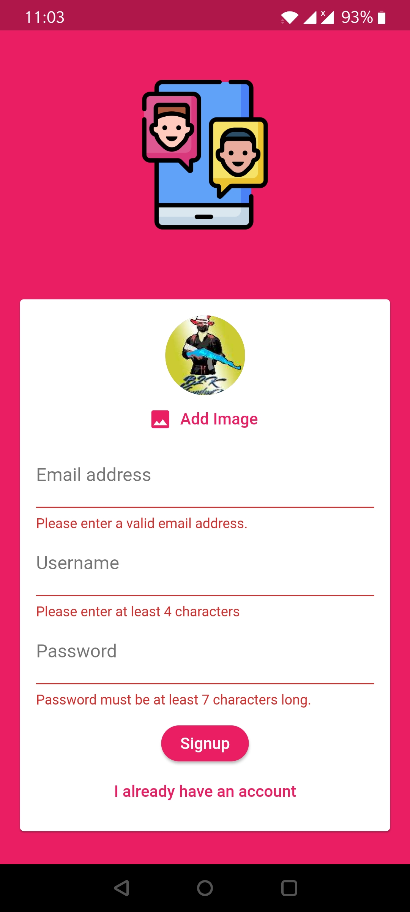
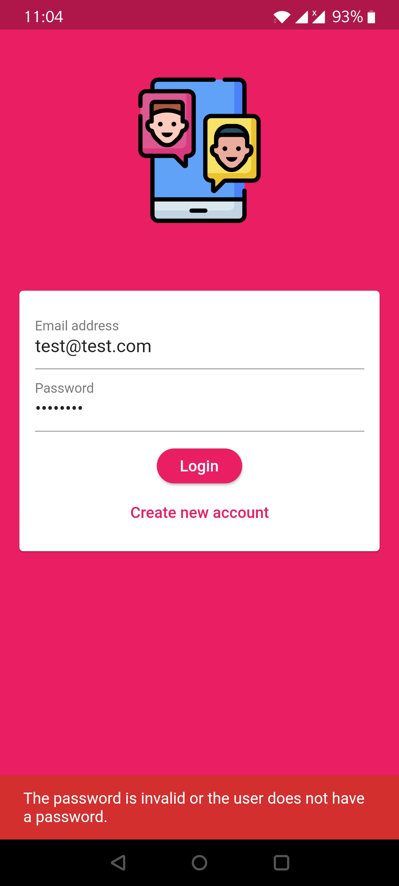

# chitchat_app
A flutter app includes firebase authentication,storage,realtimeDB,cloud messaging . In this ,users can add chats and gets displayed .
<table>
  <tr>
    <td>Create Account page</td>
     <td>Login Page</td>
     <td>Chat Screens</td>
    <td>Chat Screens</td>
    <td>Notification ScreenShot</td>
  </tr>
  <tr>
    <td></td>
    <td></td>
    <td></td>
      <td></td>
      <td></td>
  </tr>
 </table>
   

